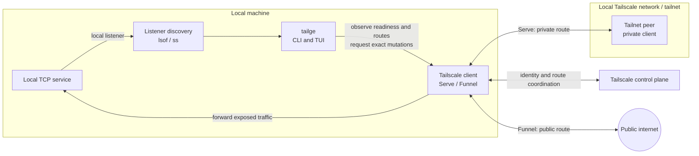

# tailge

`tailge` discovers TCP listeners on the current machine and manages explicitly selected targets through Tailscale Serve and Funnel. It never implicitly starts, stops, or restarts processes and never force-kills them; the TUI may send one explicitly confirmed SIGTERM to the selected process.

## Requirements

- Go 1.25.10 or newer to build from source (the minimum includes current standard-library security fixes).
- macOS or Linux for local TCP discovery.
- An installed, logged-in Tailscale client for exposure features.
- An interactive TTY for the TUI. Use the CLI from scripts, pipes, and CI.

## Build and install

From the repository root:

```sh
make setup
tailge --help
```

`make setup` builds the latest source and installs `tailge` in `$HOME/.local/bin`. If that directory is not already in `PATH`, add it to your shell profile:

```sh
export PATH="$HOME/.local/bin:$PATH"
```

Run `make help` to see the available development and validation targets. `make run ARGS="scan --json"` forwards arguments to `tailge`; `make tui` builds and launches the interactive interface. `make cross-build` only writes platform artifacts under `dist/`; use `make build` when manually running the local `./tailge` binary after source changes.

## Continuous integration

GitHub Actions runs on pushes to `main`, pull requests, and manual dispatches. The workflow installs pinned `staticcheck`, `golangci-lint`, and `govulncheck` tools, then runs the full quality target with one-second fuzz campaigns and builds Linux amd64 and Darwin arm64 artifacts. Reproduce the CI quality job locally with:

```sh
mkdir -p "$PWD/.tools/bin"
GOBIN="$PWD/.tools/bin" go install honnef.co/go/tools/cmd/staticcheck@2025.1.1
GOBIN="$PWD/.tools/bin" go install github.com/golangci/golangci-lint/cmd/golangci-lint@v1.64.8
GOBIN="$PWD/.tools/bin" go install golang.org/x/vuln/cmd/govulncheck@v1.1.4
PATH="$PWD/.tools/bin:$PATH" make quality FUZZTIME=1s
make cross-build
```

## Architecture and control flow

### System context

Tailge runs on the same machine as the local services it discovers. It observes local listeners and controls the local Tailscale client; it does not proxy application traffic or control processes on remote machines.



The two exposure paths have different audiences:

- **Serve** forwards a selected local listener to authenticated peers on the tailnet.
- **Funnel** forwards a selected local listener to the public internet and always requires explicit public confirmation.
- **Tailge** remains a control and observation plane. The application data path runs between the local service, Tailscale, and the selected client network.
- A route is not proof that the local process is healthy; Tailge refreshes listener state and provider state independently, then reports unknown or unverified outcomes instead of guessing.

The internal TUI control flow, including refresh coordination, workspace snapshots, action previews, and the fail-closed mutation gate, is documented in [`docs/architecture.md`](docs/architecture.md).

## How to use

### 1. Discover local listeners

Discovery works without Tailscale:

```sh
tailge scan
tailge scan --json
```

The scan reports the address, port, process, PID when available, metadata quality, and network scope. On Linux, `tailge` uses `lsof` when available and falls back to `ss`.

### 2. Start the interactive TUI

Run `tailge` in a terminal:

```sh
tailge
```

The interactive interface is a full-screen Bubble Tea workspace. It enters the alternate screen and raw keyboard mode only after TTY validation, and restores terminal state on exit. On terminals at least 100 columns by 24 rows it shows a roughly 40/60 service-list/detail split; smaller terminals collapse to one focused pane. The list is selected first and refreshes preserve stable item identity.

| Key | Action |
|---|---|
| `j` / `k`, `n` / `N`, arrows | Navigate the list or scroll details |
| `Tab` / `Shift-Tab`, `h` / `l` | Change pane focus |
| `Enter` | Focus/expand details; never mutates |
| `gg`, `G`, `Home`, `End` | First/last item |
| `/` | Incremental search; `Enter` accepts, `Esc` cancels, `Ctrl-u` clears while editing |
| `s` / `f` / `d` | Open Serve/Funnel/Disable action preview |
| `Space` | Open the exposure action selector |
| `v` | Toggle selection of the current item |
| `V` (`Shift-v`) | Enter/exit Vim-style visual-line selection; move to extend without clearing prior selections |
| `r` / `R` | Refresh / fresh retry preview after a failed operation |
| `C` / `Ctrl-l` | Clear the accepted service filter and restore the full list |
| `c` | Open confirmed cancellation for an Applying operation |
| `o` | Open the observed URL; Serve TCP routes may resolve the reported Tailscale DNS name and port and use HTTP by default, while Funnel TCP routes without a URL report `TCP-only` |
| `O` | Open the selected listener at `http://localhost:<port>/` |
| `y` | Copy the observed URL through terminal OSC 52; Serve TCP routes without one resolve and copy the HTTP preview |
| `x` | Open process termination confirmation for current local process(es); inactive configured routes have no process and direct you to `d` |
| `U` | Clear all selected items |
| `X` | Dismiss visible feedback |
| `:` | Searchable command palette: `:refresh`, `:retry`, `:serve 3000`, `:funnel 3000`, `:disable 3000`, `:sort port`, `:config show`, `:config set key value`, `:config validate`, `:quit` |
| `?` | Scrollable help |
| `q` / `Ctrl-c` | Quit; guarded while Applying |

The Service List uses one consistent table with a `SELECT` column: `[ ]` is unselected, `[✓]` is normally selected, and `[V]` marks rows in the active Vim visual range. Items sharing a port are shown as one row and exposed using the available local port. During confirmed process termination, the currently terminating listener shows `TERMINATING` in the Status column; selected batches advance one process at a time. The bottom bar shows `ok`, `off`, `TCP-only`, or `URL-only` indicators for `o`, `O`, and `y` based on the selected item and available browser/clipboard integration. Interactive `y` uses the terminal's OSC 52 transport, so a URL copied in an SSH/Mosh or multiplexer session reaches the terminal client rather than only the host OS clipboard. A Serve TCP browser preview uses only the provider-reported DNS name and exact listener port after an explicit `o` or `y` action and uses HTTP by default; it never changes exposure identity or mutation behavior. `y` copies that same derived preview when no observed URL is present.

Action previews default to Cancel. `s`, `f`, and `d` apply to the current item or selected items. Multi-item operations run sequentially, verify each target independently, and report per-target results after refresh. Every exposure action uses the ordinary focused Confirm/Cancel window; Funnel shows a prominent public-internet warning and requires explicitly moving focus to Confirm. Unknown, Unavailable, stale, ambiguous, and read-only states block unsafe exposure changes rather than guessing. The TUI keeps local discovery usable when Tailscale or one of the data sources is unavailable. Focused panes, modal borders, section headings, warnings, route states, and readiness indicators use distinct colors; the same information remains visible through text and icons. `color_theme auto` (the default), `dark`, and `light` are supported. Use `NO_COLOR=1` for text-only state indicators.

The workspace loads configuration, listener discovery, and Tailscale readiness asynchronously. The detail pane labels Serve and Funnel readiness, issues, remediation, and operation state independently, so every warning and next action identifies its owner. Long command lines, readiness explanations, and modal content wrap to the available pane width; very small terminals show a resize notice instead of an overflowing modal. The list groups local listeners, inactive configured routes, and unknown/unavailable rows; the detail pane keeps Summary, Alerts, Action Items, Listener, Exposure Routes, Readiness, Operation, and Safety sections visible. Refresh is periodic with bounded backoff and never steals focus. After the first load, refresh uses stale-while-revalidate: the last known list, details, selection, and focus remain visible while a `↻ Refreshing...` indicator is shown. Failed refreshes preserve the cached rows and surface a warning instead of blanking the workspace. A completed, failed, cancelled, or unverified operation remains visible until the next observed state or explicit dismissal.

### 3. Check Tailscale readiness

Read-only status does not prove that mutations are safe:

```sh
tailge doctor --tailscale
tailge doctor --tailscale --json
tailge exposure status
tailge exposure status --json
```

Serve and Funnel readiness are reported separately. `read_only` is a deliberate fail-closed state, not a Tailscale login failure: the daemon, identity, and connection can all be ready while mutation capability remains unverified. Serve still requires its persisted compatibility evidence. Funnel is enabled automatically when the installed CLI exposes exact per-listener `--https`/`--tcp` operations; each mutation performs bounded read-after-write verification, while public exposure still requires the explicit confirmation screen. A provider exposing only broad `funnel reset` cannot be used safely, so Funnel remains read-only. Tailscale's Serve and Funnel status JSON can describe the same underlying endpoint; Tailge classifies it as Funnel only when the matching `AllowFunnel` entry is explicitly `true`, otherwise it remains a private Serve route. The hostname/URL can therefore be the same while the access scope differs. The TUI detail pane shows each mode's status, reason, and remediation.

### 4. Run an optional compatibility probe

Use a disposable listener to verify exact Serve or Funnel support before managing real services:

```sh
python3 -m http.server 39001 --bind 127.0.0.1

tailge doctor --tailscale \
  --probe serve \
  --target 127.0.0.1:39001 \
  --confirm-test-route
```

Or let Tailge create a temporary listener with `--self-test-listener`. Funnel probes additionally require `--confirm-public`. Probes use exact selectors, verify cleanup, and never target an application listener. The probe is optional; every real mutation performs its own fresh verification.

### 5. Manage exposure from the CLI

Use an exact listener target, either as `address:port` or as a port with `--address`:

```sh
# Private tailnet exposure
tailge exposure serve 127.0.0.1:3000
tailge exposure serve 3000 --address 127.0.0.1

# Public exposure; the confirmation is mandatory
tailge exposure funnel 127.0.0.1:3000 --confirm-public

# Disable one exact route
tailge exposure disable 127.0.0.1:3000

# If the target has both Serve and Funnel routes, select one explicitly
tailge exposure disable 127.0.0.1:3000 --mode serve
```

Add `--json` to mutation commands for a machine-readable response. Routes with unknown or external ownership require `--confirm-external` before replacement or removal:

```sh
tailge exposure disable 127.0.0.1:3000 --confirm-external --json
```

Every mutation is bounded, serialized per target, protected by fresh route fingerprints, and verified with a fresh provider read. Replacements also require a deterministic provider selector that can restore the previous route exactly if the new operation fails; service-style selectors remain unchanged rather than being guessed during rollback. A command that cannot prove its final state is reported as unverified; it is not reported as success. `--mode serve|funnel` selects one exact route when a target has more than one exposure route; omitting it remains fail-closed.

### 6. Configure preferences

Press `C` (or `Ctrl-l`) at any time after accepting a filter to clear it; `/` then edits it and `Ctrl-u` clears text while search is active.

The TUI creates `~/.tailge/config.tailge` on first run. The directory is owner-only (`0700`) and the file is owner read/write (`0600`). No credentials are stored. `s`, `f`, and `d` open an explicitly labeled exposure preview for Serve, Funnel, and Disabled; the selected shortcut and target are shown immediately, and no provider mutation occurs until confirmation.

```sh
tailge config path
tailge config show
tailge config validate
tailge config set refresh_interval 10s
tailge config set operation_timeout 30s
tailge config set sort name
tailge config set color_theme dark
```

Supported settings also include `show_system_listeners` and `show_inactive_configured_ports`. `config validate` checks the file but does not create a missing one. Invalid or unsafe configuration is preserved and mutations fail closed.

### 7. Enable shell completion

```sh
tailge completion bash > "$HOME/.local/share/bash-completion/completions/tailge"
tailge completion zsh > "$HOME/.zfunc/_tailge"
tailge completion fish > "$HOME/.config/fish/completions/tailge.fish"
```

Create the parent directory first if needed. Reload the relevant shell after installing completion.

## Inactive and external routes

A configured route whose local listener is gone is shown as `Inactive configured`. It is never automatically removed or re-enabled. Review its scope and use an explicit disable command if it is stale.

Routes not created and verified by the current `tailge` session are treated as external or unknown. They remain visible, but replacement and removal require explicit confirmation and exact provider identity.

## Exit codes and JSON

CLI commands return stable exit classes:

- `0` — success
- `2` — invalid, ambiguous, or unsupported input
- `3` — dependency unavailable or readiness is read-only/not ready
- `4` — permission denied
- `5` — timeout or cancellation
- `6` — operation or safety refusal
- `7` — verification or unknown state
- `8` — configuration failure
- `130` — interruption

JSON responses use `schema_version: 1` and include `data`, `warnings`, and/or structured `errors` where applicable.

## Safety and limitations

- Only the current machine is supported; remote-machine control is not implemented.
- TCP is supported; UDP is deferred.
- Tailscale behavior is version-specific. Unsupported or unverified exact operations remain read-only.
- Local status cannot prove tailnet reachability or public internet reachability; those are separate operator checks.
- Tailscale credentials, application secrets, and implicit application lifecycle operations are outside `tailge`; explicit process termination is limited to a selected, revalidated PID, sends SIGTERM only, and never escalates to SIGKILL.

## Development checks

Run the repository checks from its root:

```sh
make check
make quality FUZZTIME=1s
make cross-build
```

`make check` formats and tests the code, runs race tests, and invokes `go vet`. `make quality` adds linting, vulnerability scanning, and bounded parser fuzzing. The GitHub Actions workflow runs the same quality checks.

## Project documentation

- [`docs/architecture.md`](docs/architecture.md) — internal control flow, TUI module seams, and safety invariants.
- [`docs/adr/0001-full-screen-tui.md`](docs/adr/0001-full-screen-tui.md) — accepted full-screen Bubble Tea decision.
- [`CONTEXT.md`](CONTEXT.md) — domain language and interaction rules.
