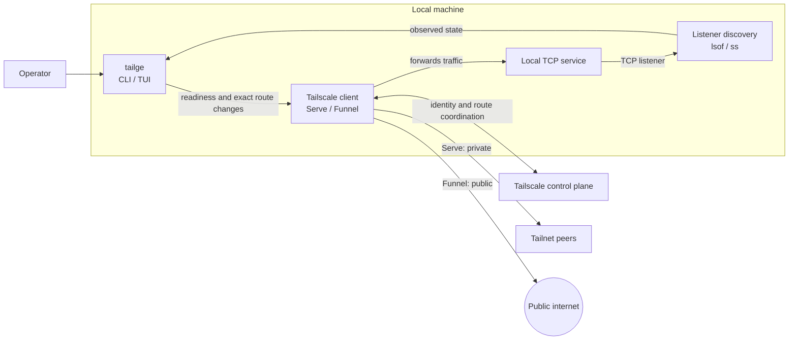

# tailge

`tailge` discovers local TCP listeners and manages explicitly selected Tailscale Serve and Funnel routes. It never implicitly starts, stops, or restarts services; the TUI may send one explicitly confirmed SIGTERM to a revalidated local process.

## System overview

Tailge is a local control and observation plane. Application traffic flows through Tailscale directly to the selected local service.



## Requirements

- Go 1.25.10+ to build from source
- macOS or Linux for listener discovery
- An installed and logged-in Tailscale client for exposure features
- An interactive TTY for the TUI; CLI commands work in scripts and CI

## Install

```sh
make setup

tailge scan
tailge
```

`make setup` installs the binary in `$HOME/.local/bin`. Add that directory to `PATH` if needed. Use `make build` to build `./tailge` locally.

## Common commands

```sh
tailge scan --json
tailge doctor --tailscale
tailge exposure status --json

tailge exposure serve 127.0.0.1:3000
tailge exposure funnel 127.0.0.1:3000 --confirm-public
tailge exposure disable 127.0.0.1:3000
```

Exposure mutations require an exact target, explicit confirmation where applicable, and fresh verification. Unknown, stale, ambiguous, unavailable, unsupported, or external state fails closed. See the [usage guide](docs/usage.md) for commands, TUI shortcuts, configuration, safety rules, and exit codes.

## Documentation

- [`docs/usage.md`](docs/usage.md) — installation, CLI and TUI usage, configuration, safety, and development checks
- [`docs/architecture.md`](docs/architecture.md) — system context, internal control flow, and safety invariants
- [`docs/adr/0001-full-screen-tui.md`](docs/adr/0001-full-screen-tui.md) — full-screen Bubble Tea decision
- [`CONTEXT.md`](CONTEXT.md) — domain language and interaction rules

## Development

```sh
make check
make quality FUZZTIME=1s
make cross-build
```
