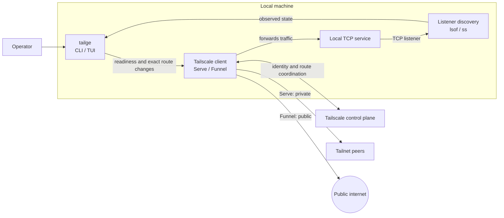

# Tailge

Tailge is a local-first Tailscale exposure manager with an opinionated, keyboard-first workspace heavily inspired by Vim: `j`/`k` navigation, `gg`/`G` jumps, and `v`/`V` selection, alongside arrow-key navigation. It discovers local TCP listeners and lets you deliberately share selected services through exact raw-TCP routes, explicit named HTTPS paths, or same-port private HTTPS roots for listeners the operator confirms speak HTTP. This matters because a listening port alone does not tell Tailge whether a service speaks HTTP. Tailge never implicitly starts, stops, or restarts services; its TUI may send one explicitly confirmed SIGTERM to a revalidated local process.

## How it works

Tailge is a local control and observation plane. Application traffic flows through Tailscale directly to the selected local service.


```mermaid
flowchart LR
    Operator[Operator]

    subgraph Local["Local machine"]
        Service["Local TCP service"]
        Discovery["Listener discovery<br/>lsof / ss"]
        Tailge["tailge<br/>CLI / TUI"]
        Tailscale["Tailscale client<br/>Serve / Funnel"]

        Service -->|TCP listener| Discovery
        Discovery -->|observed state| Tailge
        Tailge -->|readiness and exact route changes| Tailscale
        Tailscale -->|forwards traffic| Service
    end

    Operator --> Tailge
    Tailscale <-->|identity and route coordination| ControlPlane["Tailscale control plane"]
    Tailscale -->|Serve: private| Tailnet["Tailnet peers"]
    Tailscale -->|Funnel: public| Internet(("Public internet"))
```

## Prerequisites

- Go 1.25.10+ and `make` to build from source
- macOS or Linux for listener discovery
- An installed and logged-in Tailscale client for exposure features (optional for local scans)
- An interactive TTY for the workspace; CLI commands also work in scripts and CI

## Installation

From a terminal, clone the repository, download its Go dependencies, and install the binary:

```sh
git clone https://github.com/arrokh/tailge.git
cd tailge
go mod download
make setup
export PATH="$HOME/.local/bin:$PATH"
```

`make setup` installs `tailge` in `$HOME/.local/bin`; add the `PATH` line to your shell profile to keep it available in new terminals. To build without installing, run `make build` and use `./tailge` from the repository root.

## Quick start

```sh
# Inspect local listeners, then open the interactive workspace
tailge scan
tailge

# Check Tailscale readiness and current routes
tailge doctor --tailscale
tailge exposure status

# If the selected listener actually speaks HTTP, choose a private HTTPS root on its same port
# Example: local HTTP on :3000 remains unchanged; Tailscale serves HTTPS on :3000
tailge exposure http serve 127.0.0.1:3000 --root --https-port 3000
```

Open the provider-observed HTTPS URL shown by Tailge or `tailge exposure status`. For arbitrary non-web services, use the raw-TCP `tailge exposure serve` command shown below and connect with the service's own client.

## Common commands

```sh
tailge scan --json
tailge doctor --tailscale
tailge exposure status --json

tailge exposure serve 127.0.0.1:3000
tailge exposure funnel 127.0.0.1:3000 --confirm-public
tailge exposure disable 127.0.0.1:3000

# Explicit HTTPS path route to an existing local HTTP service
tailge exposure http serve '[::1]:4321' --path api
# Opt in if this Tailscale client rejects numeric IPv6 proxy destinations
tailge exposure http serve '[::1]:4321' --path api --localhost-backend
tailge exposure http funnel '[::1]:4321' --path preview --confirm-public
tailge exposure http disable '[::1]:4321' --path api --confirm-external

# Private HTTPS root on the same port as the local HTTP listener
# URL: https://<reported-MagicDNS>:4321/; backend remains http://[::1]:4321
tailge exposure http serve '[::1]:4321' --root --https-port 4321
# If that exact port currently has a raw-TCP Serve route, explicitly convert it
# Unknown/external ownership also requires --confirm-external
tailge exposure http serve '[::1]:4321' --root --https-port 4321 --replace-raw-tcp --confirm-external
tailge exposure http disable '[::1]:4321' --root --https-port 4321 --confirm-external
```

## Exposure safety

TCP listener discovery never implies HTTP: raw routes remain protocol-agnostic. Press `b` only after confirming the selected service speaks HTTP; Tailge then previews a private HTTPS root on the same port and exact backend. Replacing a conflicting Serve TCP route requires explicit conversion intent, fresh identity checks, and exact rollback on failure. `o` uses an observed HTTPS URL when available; for a Serve TCP route, it may open a UI-only HTTP preview using Tailscale-reported MagicDNS and the exact port. This does not change route identity or prove the service speaks HTTP. Funnel requires explicit public confirmation. See the [usage guide](docs/usage.md#routes-and-safety) and [architecture guide](docs/architecture.md#named-https-path-routes) for transport and route-identity context.

## Keyboard shortcuts

| Key | Action |
|---|---|
| `j` / `k`, arrows | Navigate the service list |
| `gg` / `G` | Jump to the first / last service |
| `/` | Search the list |
| `w` | Toggle filter to services whose mode is not OFF (default: all services) |
| `Tab` / `Shift-Tab` | Switch between list and details |
| `s` / `f` / `d` | Open Serve / Funnel / Disable; press the same key in the selector to choose, then confirm separately |
| `b` | Preview a private HTTPS root on the selected TCP listener's exact port (explicit HTTP intent) |
| `o` | Open an observed HTTPS URL, or preview a Serve TCP route via Tailscale MagicDNS |
| `O` | Open the selected local listener at `http://localhost:<port>/` |
| `y` | Copy an observed HTTPS URL or the same Serve TCP preview |
| `v` / `V` | Toggle an item / enter Vim-style visual-line selection |
| `x` | Confirm process termination; identity is revalidated and only SIGTERM is sent |
| `e` / `S` | Cycle sort order |
| `z` | Zoom the focused pane; press again to restore the split |
| `?` | Open help |

See the [interactive workspace guide](docs/usage.md#interactive-workspace) for the full shortcut reference, process metrics, and modal behavior.

## Documentation

- [`docs/usage.md`](docs/usage.md) — installation, CLI and TUI usage, configuration, safety, and development checks
- [`docs/architecture.md`](docs/architecture.md) — system context, domain-scoped TUI modules, internal control flow, and safety invariants
- [`docs/adr/0001-full-screen-tui.md`](docs/adr/0001-full-screen-tui.md) — full-screen Bubble Tea decision
- [`CONTEXT.md`](CONTEXT.md) — domain language and interaction rules

## Development

```sh
make check
make quality FUZZTIME=1s
make cross-build
```

## License

Tailge is licensed under the [MIT License](LICENSE).
