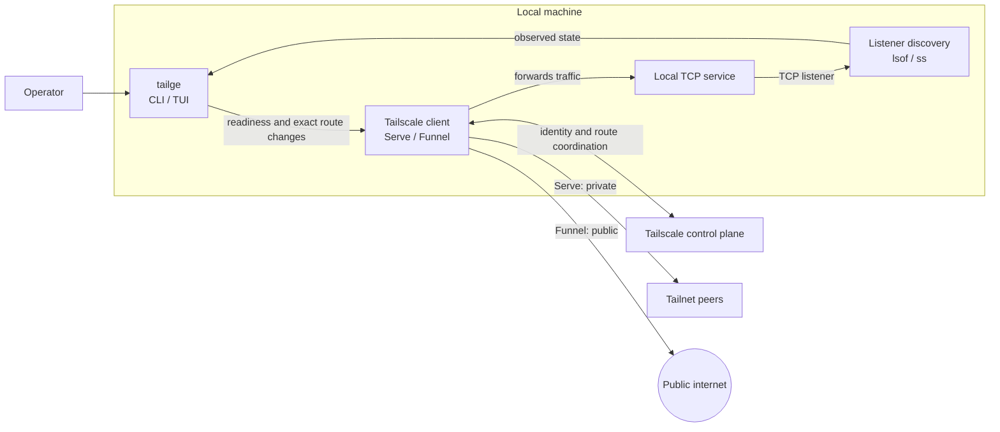

# tailge

`tailge` discovers local TCP listeners and manages explicitly selected Tailscale Serve and Funnel routes. It never implicitly starts, stops, or restarts services; the TUI may send one explicitly confirmed SIGTERM to a revalidated local process.

## System overview

Tailge is a local control and observation plane. Application traffic flows through Tailscale directly to the selected local service.


```mermaid
flowchart LR
    Operator[Operator]

    subgraph Local["Local machine"]
        Service["Local TCP service"]
        Discovery["Listener discovery<br/>lsof / ss"]
        Tailge["tailge<br/>CLI / TUI"]
        Tailscale["Tailscale client<br/>Serve / Funnel"]

        Service -->|TCP listener| Discovery
        Discovery -->|observed state| Tailge
        Tailge -->|readiness and exact route changes| Tailscale
        Tailscale -->|forwards traffic| Service
    end

    Operator --> Tailge
    Tailscale <-->|identity and route coordination| ControlPlane["Tailscale control plane"]
    Tailscale -->|Serve: private| Tailnet["Tailnet peers"]
    Tailscale -->|Funnel: public| Internet(("Public internet"))
```

## Requirements

- Go 1.25.10+ to build from source
- macOS or Linux for listener discovery
- An installed and logged-in Tailscale client for exposure features
- An interactive TTY for the TUI; CLI commands work in scripts and CI

## Install

```sh
make setup

tailge scan
tailge
```

`make setup` installs the binary in `$HOME/.local/bin`. Add that directory to `PATH` if needed. Use `make build` to build `./tailge` locally.

## Common commands

```sh
tailge scan --json
tailge doctor --tailscale
tailge exposure status --json

tailge exposure serve 127.0.0.1:3000
tailge exposure funnel 127.0.0.1:3000 --confirm-public
tailge exposure disable 127.0.0.1:3000

# Explicit HTTPS path route to an existing local HTTP service
tailge exposure http serve '[::1]:4321' --path api
# Opt in if this Tailscale client rejects numeric IPv6 proxy destinations
tailge exposure http serve '[::1]:4321' --path api --localhost-backend
tailge exposure http funnel '[::1]:4321' --path preview --confirm-public
tailge exposure http disable '[::1]:4321' --path api --confirm-external

# Explicit HTTPS root handler on a custom port (tailnet-private Serve)
tailge exposure http serve '[::1]:4321' --root --https-port 4321 --localhost-backend
tailge exposure http disable '[::1]:4321' --root --https-port 4321 --confirm-external
```

Named HTTP paths use Tailscale HTTPS on standard port 443; an explicit `--root --https-port PORT` route maps `/` on a custom HTTPS port and prints the observed URL including that port. Both forward HTTPS-terminated traffic to an existing local HTTP listener; HTTP is never inferred from TCP discovery. Custom root routes are Serve-only and remain tailnet-private. IPv6 numeric backends remain the default; if Tailscale responds with `unknown proxy destination`, first disable the exact handler, then explicitly choose `--localhost-backend` (or `Ctrl+B` in the `p` dialog) when recreating it. This uses hostname resolution and weakens exact-address guarantees; Tailge never substitutes it silently. Provider status verification confirms configuration, not that the backend proxy works, so open the reported URL to smoke-test delivery. Funnel makes every named path on the shared endpoint public and requires confirmation. Existing raw-TCP commands remain unchanged. In the workspace, `p` previews and creates a named path, `o` only opens an observed URL, and `y` copies it (both ask which URL when several exist); `O` remains the local `http://localhost:<port>/` convenience URL, not evidence that remote raw TCP speaks HTTP.

Exposure mutations require an exact target, explicit confirmation where applicable, and fresh verification. Multiple complete, distinct routes for one listener display as active with mode `MULTI`; `d` opens an exact-route chooser, while aggregate mode changes remain blocked. Unknown, stale, ambiguous, unavailable, unsupported, or external route identity fails closed. See the [usage guide](docs/usage.md) for commands, TUI shortcuts, configuration, safety rules, and exit codes.

In the workspace, `v`/`V` multi-selection applies to both exposure previews (`s`/`f`/`d`) and guarded process termination (`x`); termination confirms once, revalidates every selected process, and sends SIGTERM sequentially. Listener rows show CPU and memory when available: macOS physical footprint (falling back to RSS), or Linux RSS. New installations sort by service name ascending; `S` cycles ascending, descending, and unsorted. The grouped footer adapts its navigation hints to terminal width. Press `z` to zoom the focused list or details pane to the full workspace area, then press it again to restore the split.

## Documentation

- [`docs/usage.md`](docs/usage.md) — installation, CLI and TUI usage, configuration, safety, and development checks
- [`docs/architecture.md`](docs/architecture.md) — system context, domain-scoped TUI modules, internal control flow, and safety invariants
- [`docs/adr/0001-full-screen-tui.md`](docs/adr/0001-full-screen-tui.md) — full-screen Bubble Tea decision
- [`CONTEXT.md`](CONTEXT.md) — domain language and interaction rules

## Development

```sh
make check
make quality FUZZTIME=1s
make cross-build
```
