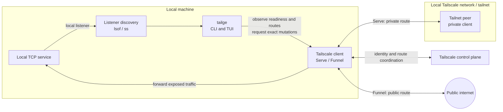
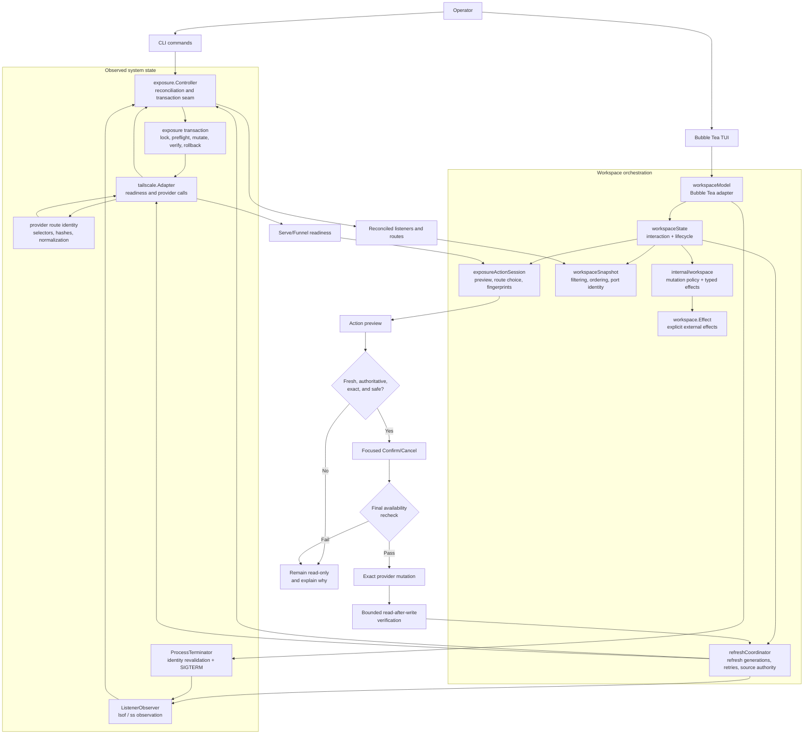

# Tailge architecture

This document describes Tailge's system context, internal control flow, implementation seams, and safety invariants. The usage guide is [`usage.md`](usage.md), the domain contract is [`CONTEXT.md`](../CONTEXT.md), and the accepted full-screen decision is [`adr/0001-full-screen-tui.md`](adr/0001-full-screen-tui.md).

## System context

Tailge runs on the same machine as the local services it discovers. It observes local listeners and controls the local Tailscale client; it does not proxy application traffic or control processes on remote machines.



The exposure paths have different audiences:

- **Serve** forwards a selected local listener to authenticated tailnet peers.
- **Funnel** forwards a selected local listener to the public internet and always requires explicit public confirmation.
- **Tailge** remains a control and observation plane. Application data flows between the local service, Tailscale, and the selected client network.
- A route is not proof that the local process is healthy. Tailge refreshes listener state and provider state independently and reports unknown or unverified outcomes instead of guessing.

## Runtime shape

```text
Bubble Tea event loop
        |
        v
workspaceModel  -- terminal adapter: messages, commands, rendering
        |
        +--> workspaceState -- interaction state and lifecycle
        |
        +--> internal/workspace -- policy + typed effects
        |       |
        |       +--> exposure/readiness/discovery domain types
        |
        +--> workspaceEffect adapter --> provider, process, browser, clipboard, config effects
        |
        +--> exposure.Controller --> discovery + Tailscale provider
        +--> tailscale.Adapter --> capability/readiness/exact mutations
```

`internal/workspace` is the deep, framework-independent Service workspace module: it owns mutation availability, readiness explanations, exact URL/transport classification, process fingerprints, operation-state mapping, and typed shortcut effects. Its interface is data in and policy/effects out; it does not import Bubble Tea or open browsers, invoke commands, mutate providers, or terminate processes. `workspaceModel` and `workspaceState` remain the terminal adapter's interaction state and lifecycle owner: they translate Bubble Tea messages, supply observations to `internal/workspace`, execute typed effects, and project state through the render modules. The implementation is split by domain so each flow has locality:

- `tui.go` owns refresh helper functions, the Bubble Tea update loop, and terminal entry/exit; `workspace_model.go` owns the Bubble Tea adapter type and model construction.
- `workspace_messages.go` owns asynchronous Bubble Tea message types; `workspace_ui_types.go` owns pane/modal state types and values; `workspace_layout.go` owns rendering thresholds.
- `workspace_input.go` owns keyboard scope, navigation, incremental search, the command-palette input, and modal transitions.
- `workspace_exposure.go` owns exposure action previews, confirmation invalidation, mutation approvals, single-target operations, and sequential batch operations.
- `workspace_process.go` owns guarded process termination orchestration and sequential process batches; process identity fingerprints come from `internal/workspace`.
- `workspace_commands.go` owns cancellation/quit decisions, retry previews, palette command dispatch, and config commands.
- `workspace_urls.go` owns browser launching, clipboard transport, and adapter-level URL actions; observed URL selection and Serve TCP preview resolution come from `internal/workspace`.
- `workspace_feedback.go` owns banners and theme-aware text painting; readiness explanations come from `internal/workspace`; `workspace_text.go` owns ANSI-safe text sanitization and shared layout helpers.
- `workspace_effects.go` owns external-effect dispatch and quit/cancellation timing; `internal/workspace/effects.go` owns the typed effect vocabulary; exposure and process-specific operation types stay beside their orchestration modules.
- `workspace_policy.go`, `workspace_render.go`, `workspace_modal.go`, `workspace_snapshot.go`, `action_session.go`, and `refresh_coordinator.go` retain their focused adapter, projection, snapshot, preview, and refresh seams.

This keeps state transitions and safety decisions testable without terminal orchestration, while external effects remain explicit and the reusable policy has a small local seam.

## CLI bootstrap and domain ownership

The repository follows the conservative [official Go module layout guidance](https://go.dev/doc/modules/layout): `cmd/tailge` is the executable entrypoint and supporting application code remains under `internal/`; no public `pkg/` promise is made for this self-contained CLI/TUI. The Medium folder proposal is used selectively: HTTP-specific handlers/routes and generic utility folders are not meaningful seams for Tailge, so they are intentionally absent.

The CLI has one narrow process entrypoint and two internal modules:

```text
cmd/tailge/main.go
        |
        +--> internal/bootstrap.New      concrete runner, discovery, provider, config
        |
        +--> internal/cli.Run             command parsing, orchestration, output, exit policy
                    |
                    +--> internal/{config,discovery,exposure,probe,tailscale}
```

`internal/model` was removed as a cross-domain dependency hub. Target normalization/correlation lives in `internal/target`; listener observations and snapshots live in `internal/discovery`; exposure route, snapshot, and operation records live in `internal/exposuredata`; readiness records live in `internal/readiness`; and the small safe error/exit-code vocabulary lives in `internal/fault`. The domain packages own their invariants while callers retain explicit seams for discovery, exposure, readiness, provider adapters, and TUI policy. `internal/exposuredata` is deliberately named for the exposure domain rather than becoming a generic `internal/domain` dumping ground.

## Internal control flow

Refreshes build a shared snapshot. Exposure actions use that snapshot for a preview, then repeat the safety checks immediately before an exact mutation and read-after-write verification.



The safety gate is fail-closed: stale, ambiguous, unavailable, unsupported, external, or unverified state never becomes an unsafe mutation.

## Exposure action session

`internal/tui/action_session.go` owns the state that begins at an action shortcut and ends at a verified operation request:

- selected action and current choice index;
- exact target and route selector;
- preview fingerprints for routes, listeners, and selected targets;
- typed availability, including a refresh-wait outcome;
- focused confirmation state.

`workspaceModel` supplies current observations and readiness through the action-availability seam. The session consumes those choices without reading the refresh lifecycle directly. This keeps `EXPOSURE ACTION` stable while refresh runs and keeps safety checks fail-closed.

Operation start is implemented in `internal/tui/workspace_exposure.go` because it must register the target with the workspace's Applying lifecycle. It rechecks the action session's preview, re-evaluates current action availability at the mutation boundary, and refuses to start while refresh is pending or readiness has become unsafe. `internal/exposure/exact_operation.go` owns the shared lock, preflight, exact mutation, verification, and rollback protocol; `internal/exposure/transaction.go` adapts its result into Controller lifecycle, ownership, and operation events.

## Listener observation and process termination

`internal/discovery` exposes `ListenerObserver` and `ProcessTerminator` as separate consumer-owned seams. `OSListenerObserver` owns lsof/ss command selection, parsing, fallback, partial snapshots, metadata enrichment, bounded output, and redaction. `OSProcessTerminator` consumes only the observer seam: immediately before signalling it requires an authoritative exact listener match, revalidates PID, target, process name, command line when present, and process-start identity, then sends one SIGTERM and verifies without SIGKILL escalation. Cancellation, timeout, permission, and identity uncertainty remain fail-closed and report unknown or unverified state.

The compatibility `OSDiscoverer` name forwards to the observer and is retained for existing CLI callers, but the Service workspace receives the listener observer and process terminator independently. This prevents process termination from depending on a concrete discovery type assertion and keeps observation tests independent from destructive-operation tests.

## Exposure transaction

`internal/exposure/transaction.go` is the mutation seam behind `exposure.Controller`. A `mutationTransaction` owns the ordered safety protocol:

1. validate target and requested mode;
2. reserve the target and acquire the shared mutation lock;
3. read authoritative listeners and routes;
4. revalidate approval fingerprints and exact listener identity;
5. remove an exact route when replacement is required;
6. set the requested route through the provider Adapter;
7. verify the final route or restore the previous route with a fresh cleanup context;
8. publish ownership and operation lifecycle state.

The Controller remains the reconciliation and lifecycle owner, while the transaction implementation concentrates mutation knowledge. CLI and Service workspace callers do not repeat the protocol.

## Tailscale provider protocol

The provider adapter is split into cohesive internal modules while preserving the `Exposer` surface. `provider_commands.go` owns executable discovery, bounded command execution, timeout/cancellation and provider-error classification, sanitization, and redaction. `provider_status.go` owns status decoding, target/handler validation, Serve/Funnel route observation, partial snapshots, and `AllowFunnel`-only interpretation. `provider_capabilities.go` owns version/help capability detection and readiness policy. `provider_mutation.go` owns exact Set/Remove translation and precondition checks. `provider_identity.go` owns target matching and route fingerprints; `route_identity.go` remains the canonical selector and handler-validation module.

Each parser and policy module remains directly fixture-testable without starting a command. The command adapter is the only owner of Tailscale syntax and bounded output; callers continue to request domain operations and cannot reconstruct provider selectors. Malformed, incomplete, permission-denied, timed-out, or redaction-sensitive provider output remains fail-closed.

## Provider route identity

`internal/tailscale/route_identity.go` owns canonical route identity. `RouteIdentity` is the shared representation used by route hashes and managed-route fingerprints; deterministic listener selectors are parsed once and rejected when they are service-shaped or otherwise ambiguous. Provider status walking, capability/readiness evaluation, command execution, and exact mutation translation now have separate internal owners, while provider selector rules no longer need to be reconstructed by exposure callers. The status parser also treats an `AllowFunnel`-only payload as an authoritative empty route set: permission can outlive the last handler, and that state must not be mistaken for an unknown active route.

## Compatibility probe lifecycle

`internal/probe/probe.go` owns the disposable compatibility-probe lifecycle. It validates the loopback listener, acquires the shared lock, checks authoritative state and capabilities, performs the bounded mutation, handles uncertain creation, cleans the exact observed route, verifies removal, and persists version evidence. `internal/cli` owns command parsing/reporting and `internal/bootstrap` owns concrete adapter construction; `cmd/tailge/main.go` only supplies process streams and starts the CLI.

## Workspace policy and rendering

`internal/workspace/policy.go` owns action availability, readiness explanations, operation-state decisions, URL transport classification, exact Serve TCP preview resolution, and process fingerprints. `internal/tui/workspace_policy.go` retains only process-control orchestration that must inspect the current TUI selection and OS process protections. `workspaceModel` still owns Bubble Tea event sequencing and Applying registration, but delegates input, exposure, process, URL, and feedback flows to their focused modules. `workspace_render.go` and `workspace_modal.go` own the visual projection and modal/help layout, leaving event handling easier to scan without changing ADR-0001's full-screen workspace. Browser actions use the policy module: observed HTTP/HTTPS URLs win; a Serve `tcp=` route without an observed URL may resolve the provider-reported DNS name and exact listener port for the same HTTP browser preview used by `o` and `y`. This UI-only fallback never participates in route identity, approval, mutation, or verification. Interactive `y` copies through OSC 52 so SSH/Mosh and multiplexer sessions update the attached terminal client's clipboard rather than only the host OS clipboard. Funnel TCP without an observed URL remains `TCP-only` and is not copyable.

## Refresh coordinator

`internal/tui/refresh_coordinator.go` owns refresh lifecycle policy:

- monotonically increasing generations;
- one refresh at a time with coalesced follow-up requests;
- independent listener/exposure and readiness completion;
- stale and duplicate result rejection;
- bounded failure streak and retry-preview intent.

`workspaceModel` still publishes each accepted `viewLoadedMsg` and `readinessLoadedMsg`, but the coordinator decides whether a message belongs to the current generation and when the complete refresh can publish its next state. `exposure.Controller` and `tailscale.Adapter` remain the two concrete source adapters.

## Workspace snapshot

`internal/tui/workspace_snapshot.go` is the presentation seam for reconciled observations. `workspaceSnapshot.Items` applies the shared rules for:

1. presentation preferences and visibility rules;
2. configured ordering and visual sections;
3. same-port identity collapse with merged exposure routes;
4. accepted filter applied to the merged row text.

List rendering, details, selection continuity, and exposure action targeting all consume `workspaceModel.items`, which delegates to this module. This prevents a list and modal from deriving different target identities from the same refresh result.

## Safety invariants

- Unknown, stale, unavailable, unsupported, ambiguous, or read-only observations never enable an unsafe mutation.
- A preview is invalidated when its target, route set, listener identity, or selected target set changes; availability is rechecked immediately before mutation. Sequential batch operations retain per-target route identity fingerprints so an earlier confirmed batch mutation does not invalidate unrelated batch members.
- Refresh can observe Applying state but cannot erase the operation lifecycle or start a concurrent mutation.
- Confirmation defaults to Cancel; Funnel requires explicit focus on Confirm.
- Exact route selectors are retained through disable and replacement operations.
- Every provider mutation performs bounded verification; unknown final state is reported as Unverified.

## Verification seams

The module tests are intentionally close to their seams:

- `internal/exposure/exact_operation.go` is exercised through controller mutation tests in `reconcile_test.go`, including approval invalidation, rollback, ownership revocation, exact route selection, and cross-operation safety.
- `internal/tailscale/provider_status.go`, `provider_capabilities.go`, `provider_mutation.go`, and `route_identity.go` have direct parser, capability, readiness, selector, fingerprint, and command-adapter tests in `tailscale_test.go`.
- `internal/probe/probe.go` has direct target and route-identity tests in `probe_test.go`, plus full disposable lifecycle tests in `internal/cli/cli_test.go`.
- `internal/workspace` has direct typed-effect, action-availability, no-op safety, process-fingerprint, and transport-classification tests in `effects_test.go` and `policy_test.go`; `internal/tui/workspace_exposure.go` adds preview invalidation, batch operation, and Applying lifecycle coverage in `tui_test.go`.
- `internal/discovery` has independent listener-observer parsing/fallback tests and process-terminator identity/cancellation tests in `discovery_test.go`.
- `internal/tui/action_session.go` has direct choice/fingerprint tests in `action_session_test.go`, plus action preview, refresh, route selection, and confirmation tests in `tui_test.go`.
- `internal/tui/workspace_input.go`, `workspace_urls.go`, `workspace_feedback.go`, and `workspace_text.go` are covered by the keyboard, URL/clipboard, rendering, ANSI-safety, and modal-layout cases in `tui_test.go`.
- `internal/tui/refresh_coordinator.go` has direct generation, coalescing, retry, and failure tests in `refresh_coordinator_test.go`.
- `internal/tui/workspace_snapshot.go` has direct target-collapse tests in `workspace_snapshot_test.go`, plus selection, filtering, sorting, port collapse, and batch-target tests in `tui_test.go`.

Run the complete local validation from the repository root:

```sh
make check
make build
```

The first command checks formatting, all tests, race behavior, and `go vet`. The build command verifies the executable still compiles after the TUI seams are assembled.
