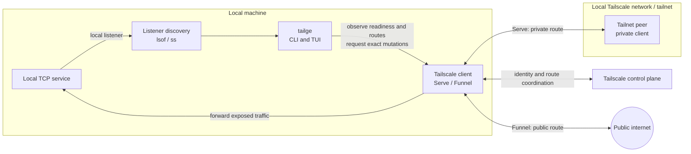
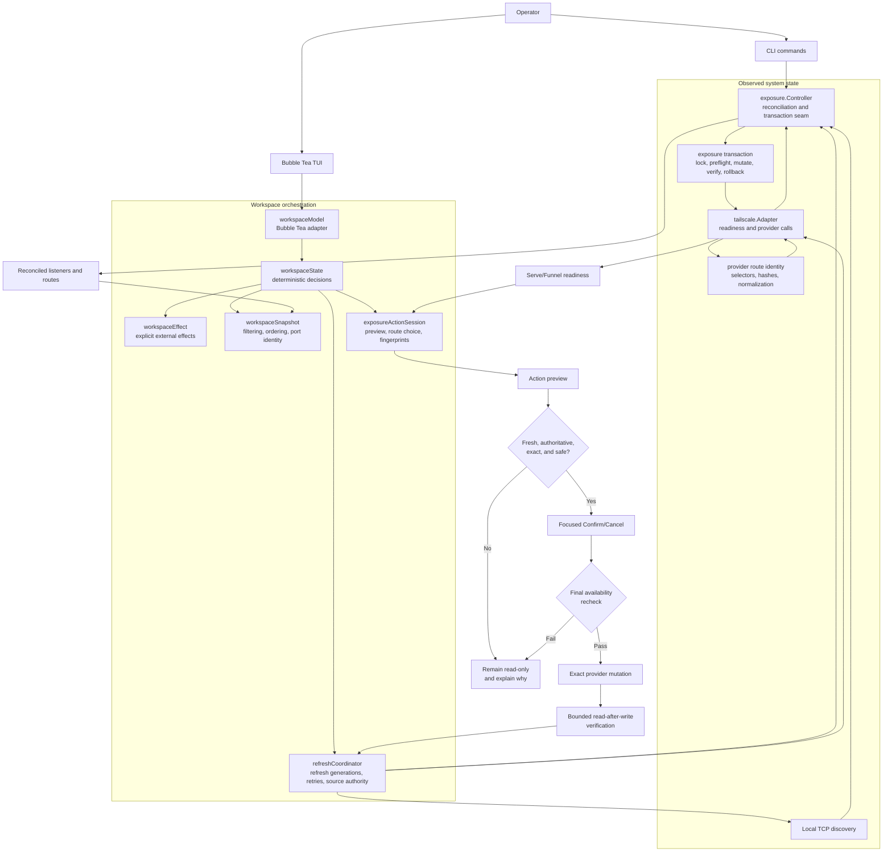

# Tailge architecture

This document describes Tailge's system context, internal control flow, implementation seams, and safety invariants. The usage guide is [`usage.md`](usage.md), the domain contract is [`CONTEXT.md`](../CONTEXT.md), and the accepted full-screen decision is [`adr/0001-full-screen-tui.md`](adr/0001-full-screen-tui.md).

## System context

Tailge runs on the same machine as the local services it discovers. It observes local listeners and controls the local Tailscale client; it does not proxy application traffic or control processes on remote machines.



The exposure paths have different audiences:

- **Serve** forwards a selected local listener to authenticated tailnet peers.
- **Funnel** forwards a selected local listener to the public internet and always requires explicit public confirmation.
- **Tailge** remains a control and observation plane. Application data flows between the local service, Tailscale, and the selected client network.
- A route is not proof that the local process is healthy. Tailge refreshes listener state and provider state independently and reports unknown or unverified outcomes instead of guessing.

## Runtime shape

```text
Bubble Tea event loop
        |
        v
workspaceModel  -- terminal adapter: messages, commands, rendering
        |
        v
workspaceState  -- deterministic decisions: focus, selection, previews, lifecycle
        |       |       |       |
        |       |       |       +--> workspacePolicy
        |       |       +----------> workspaceRender / workspaceModal
        |       +------------------> refreshCoordinator
        +--------------------------> workspaceSnapshot
        |
        +--> workspaceEffect --> provider, process, browser, clipboard, config effects
        |
        +--> exposure.Controller --> discovery + Tailscale provider
        +--> tailscale.Adapter --> capability/readiness/exact mutations
```

`workspaceState` is the decision module for the Service workspace. It owns interaction state and pure selection/lifecycle transitions without Bubble Tea or OS effects. `workspaceModel` is the terminal adapter: it translates Bubble Tea messages, executes typed `workspaceEffect` requests, and projects state through the render modules. This keeps state transitions and safety decisions testable without terminal orchestration, while external effects remain explicit.

## Internal control flow

Refreshes build a shared snapshot. Exposure actions use that snapshot for a preview, then repeat the safety checks immediately before an exact mutation and read-after-write verification.



The safety gate is fail-closed: stale, ambiguous, unavailable, unsupported, external, or unverified state never becomes an unsafe mutation.

## Exposure action session

`internal/tui/action_session.go` owns the state that begins at an action shortcut and ends at a verified operation request:

- selected action and current choice index;
- exact target and route selector;
- preview fingerprints for routes, listeners, and selected targets;
- typed availability, including a refresh-wait outcome;
- focused confirmation state.

`workspaceModel` supplies current observations and readiness through the action-availability seam. The session consumes those choices without reading the refresh lifecycle directly. This keeps `EXPOSURE ACTION` stable while refresh runs and keeps safety checks fail-closed.

The operation start remains in `internal/tui/tui.go` because it must register the target with the workspace's Applying lifecycle. It rechecks the action session's preview, re-evaluates current action availability at the mutation boundary, and refuses to start while refresh is pending or readiness has become unsafe. The transaction implementation now lives in `internal/exposure/transaction.go`, where lock acquisition, preflight, exact mutation, verification, rollback, ownership, and operation events stay together.

## Exposure transaction

`internal/exposure/transaction.go` is the mutation seam behind `exposure.Controller`. A `mutationTransaction` owns the ordered safety protocol:

1. validate target and requested mode;
2. reserve the target and acquire the shared mutation lock;
3. read authoritative listeners and routes;
4. revalidate approval fingerprints and exact listener identity;
5. remove an exact route when replacement is required;
6. set the requested route through the provider Adapter;
7. verify the final route or restore the previous route with a fresh cleanup context;
8. publish ownership and operation lifecycle state.

The Controller remains the reconciliation and lifecycle owner, while the transaction implementation concentrates mutation knowledge. CLI and Service workspace callers do not repeat the protocol.

## Provider route identity

`internal/tailscale/route_identity.go` owns canonical route identity. `RouteIdentity` is the shared representation used by route hashes and managed-route fingerprints; deterministic listener selectors are parsed once and rejected when they are service-shaped or otherwise ambiguous. Status walking and command execution stay in `tailscale.Adapter`, but provider selector rules no longer need to be reconstructed by exposure callers. The status parser also treats an `AllowFunnel`-only payload as an authoritative empty route set: permission can outlive the last handler, and that state must not be mistaken for an unknown active route.

## Compatibility probe lifecycle

`internal/probe/probe.go` owns the disposable compatibility-probe lifecycle. It validates the loopback listener, acquires the shared lock, checks authoritative state and capabilities, performs the bounded mutation, handles uncertain creation, cleans the exact observed route, verifies removal, and persists version evidence. `cmd/tailge/main.go` now handles only doctor input and reporting.

## Workspace policy and rendering

`internal/tui/workspace_policy.go` owns action availability, process identity revalidation, operation-state decisions, and route transport classification. `workspaceModel` still owns Bubble Tea event sequencing and Applying registration, but it delegates policy decisions to the focused module. `workspace_render.go` and `workspace_modal.go` own the visual projection and modal/help layout, leaving event handling easier to scan without changing ADR-0001's full-screen workspace. Browser actions open observed HTTP/HTTPS URLs when present. For a Serve `tcp=` route without an observed URL, explicit `o` and `y` actions may resolve the provider-reported DNS name and exact listener port and use the same HTTP browser preview by default; this UI-only fallback never participates in route identity, approval, mutation, or verification. Interactive `y` copies through OSC 52 so SSH/Mosh and multiplexer sessions update the attached terminal client's clipboard rather than only the host OS clipboard. Funnel TCP without an observed URL remains `TCP-only` and is not copyable.

## Refresh coordinator

`internal/tui/refresh_coordinator.go` owns refresh lifecycle policy:

- monotonically increasing generations;
- one refresh at a time with coalesced follow-up requests;
- independent listener/exposure and readiness completion;
- stale and duplicate result rejection;
- bounded failure streak and retry-preview intent.

`workspaceModel` still publishes each accepted `viewLoadedMsg` and `readinessLoadedMsg`, but the coordinator decides whether a message belongs to the current generation and when the complete refresh can publish its next state. `exposure.Controller` and `tailscale.Adapter` remain the two concrete source adapters.

## Workspace snapshot

`internal/tui/workspace_snapshot.go` is the presentation seam for reconciled observations. `workspaceSnapshot.Items` applies the shared rules for:

1. presentation preferences and visibility rules;
2. configured ordering and visual sections;
3. same-port identity collapse with merged exposure routes;
4. accepted filter applied to the merged row text.

List rendering, details, selection continuity, and exposure action targeting all consume `workspaceModel.items`, which delegates to this module. This prevents a list and modal from deriving different target identities from the same refresh result.

## Safety invariants

- Unknown, stale, unavailable, unsupported, ambiguous, or read-only observations never enable an unsafe mutation.
- A preview is invalidated when its target, route set, listener identity, or selected target set changes; availability is rechecked immediately before mutation. Sequential batch operations retain per-target route identity fingerprints so an earlier confirmed batch mutation does not invalidate unrelated batch members.
- Refresh can observe Applying state but cannot erase the operation lifecycle or start a concurrent mutation.
- Confirmation defaults to Cancel; Funnel requires explicit focus on Confirm.
- Exact route selectors are retained through disable and replacement operations.
- Every provider mutation performs bounded verification; unknown final state is reported as Unverified.

## Verification seams

The module tests are intentionally close to their seams:

- `internal/exposure/transaction.go` is exercised through controller mutation tests in `reconcile_test.go`, including approval invalidation, rollback, ownership revocation, exact route selection, and cross-operation safety.
- `internal/tailscale/route_identity.go` has direct selector and fingerprint tests in `tailscale_test.go`; parser and command tests cover the Adapter's use of the same identity rules.
- `internal/probe/probe.go` has direct target and route-identity tests in `probe_test.go`, plus full disposable lifecycle tests in `cmd/tailge/main_test.go`.
- `internal/tui/workspace_policy.go` is exercised by action availability, process identity, batch operation, and Applying lifecycle tests in `tui_test.go`.
- `internal/tui/action_session.go` has direct choice/fingerprint tests in `action_session_test.go`, plus action preview, refresh, route selection, and confirmation tests in `tui_test.go`.
- `internal/tui/refresh_coordinator.go` has direct generation, coalescing, retry, and failure tests in `refresh_coordinator_test.go`.
- `internal/tui/workspace_snapshot.go` has direct target-collapse tests in `workspace_snapshot_test.go`, plus selection, filtering, sorting, port collapse, and batch-target tests in `tui_test.go`.

Run the complete local validation from the repository root:

```sh
make check
make build
```

The first command checks formatting, all tests, race behavior, and `go vet`. The build command verifies the executable still compiles after the TUI seams are assembled.
